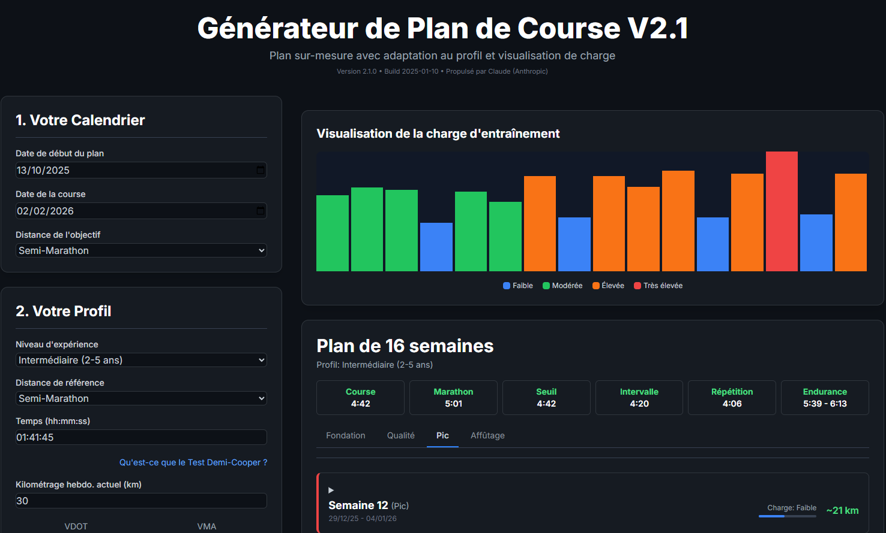

# 🏃‍♂️ Générateur de Plan de Course V2.1

> Générateur de plan d'entraînement personnalisé avec périodisation intelligente, tests de contrôle automatiques et visualisation de charge d'entraînement.

[](https://github.com/imtheyoyo/plan-course)
[](https://github.com/imtheyoyo/plan-course)
[](LICENSE)


[](https://imtheyoyo.github.io/plan-course/)


[🚀 Démo en ligne](https://imtheyoyo.github.io/plan-course/)
[📖 Documentation](https://github.com/imtheyoyo/plan-course/tree/main/docs)
[📖 Documentation technique](docs/project-documentation.md)
[🐛 Signaler un bug](https://github.com/imtheyoyo/plan-course/issues)


[](docs/General.png)


---

## ✨ Fonctionnalités

### 🎯 Planification intelligente
- **Périodisation en 4 phases** : Fondation → Qualité → Pic → Affûtage
- **Progression adaptative** : Cycles 3/1 avec micro-variations (8-12% selon niveau)
- **3 profils de coureur** : Débutant, Intermédiaire, Avancé
- **4 distances** : 5km, 10km, Semi-marathon, Marathon
- **33 types de séances** différentes adaptées à chaque niveau

### 📊 Suivi et analyse
- **Tests automatiques** toutes les 6 semaines pour ajuster les allures
- **Calcul VDOT** (formule Jack Daniels) pour personnalisation précise
- **Visualisation TSS** (Training Stress Score) pour gérer la charge
- **6 allures d'entraînement** personnalisées (E, M, T, I, R, C)

### 🎨 Interface moderne
- **Éditeur de séances structuré** : Créez et modifiez vos séances étape par étape
- **Drag & drop** : Réorganisez vos séances facilement entre les jours
- **Format flexible** : Temps (hh:mm:ss) ou distance (km/m) au choix
- **Export/Import JSON** : Sauvegardez et partagez vos plans
- **Responsive** : Fonctionne parfaitement sur mobile et tablette

---

## 🚀 Installation rapide

### Option 1 : Utilisation directe (Recommandé)
Aucune installation nécessaire ! 🎉

```bash
# 1. Cloner le projet
git clone https://github.com/imtheyoyo/plan-course.git
cd plan-course

# 2. Ouvrir dans le navigateur
open index.html
# Ou double-clic sur index.html
```

### Option 2 : Serveur local
```bash
# Avec Python 3
python -m http.server 8000

# Avec Python 2
python -m SimpleHTTPServer 8000

# Puis ouvrir : http://localhost:8000
```

### Option 3 : Live Server (VS Code)
1. Installer extension "Live Server"
2. Clic droit sur `index.html`
3. "Open with Live Server"

---

## 📖 Utilisation

### 1️⃣ Configurer votre profil
- **Dates** : Date de début et date de course (8-24 semaines recommandées)
- **Objectif** : Choisir la distance (5km, 10km, semi-marathon, marathon)
- **Niveau** : Débutant, Intermédiaire ou Avancé
- **Performance** : Entrer un temps de référence récent

### 2️⃣ Définir vos disponibilités
- Sélectionner vos jours d'entraînement (3-7 jours par semaine)
- Choisir le jour de la sortie longue (généralement week-end)

### 3️⃣ Générer et personnaliser
- Cliquer sur **"Générer mon Plan"**
- Visualiser les 4 phases de périodisation
- **Glisser-déposer** les séances pour réorganiser
- **Éditer** les séances en cliquant dessus
- **Exporter** en JSON pour sauvegarder

### 4️⃣ Suivre votre progression
- Consulter le graphique TSS pour gérer votre charge
- Tests de contrôle automatiques toutes les 6 semaines
- Ajuster les allures selon vos performances

---

## 🏗️ Architecture

```
plan-course/
├── index.html              # Interface principale
├── README.md               # Ce fichier
├── LICENSE                 # Licence MIT
├── CHANGELOG.md            # Historique des versions
│
├── css/
│   └── styles.css         # Styles personnalisés (dark theme)
│
├── docs/
│   └── TECHNICAL_DOCUMENTATION.md  # Documentation technique complète
│
└── js/
    ├── config.js          # Configuration globale
    ├── app.js             # Orchestration principale
    │
    ├── utils/             # Utilitaires
    │   ├── dates.js      # Manipulation des dates
    │   ├── formatters.js # Formatage (temps, distances, allures)
    │   └── storage.js    # LocalStorage, export/import JSON
    │
    ├── core/              # Algorithmes métier
    │   ├── vdot.js       # Calcul VDOT, TSS, allures
    │   ├── progression.js # Périodisation, cycles 3/1
    │   └── placement.js  # Placement intelligent des séances
    │
    ├── sessions/          # Bibliothèques de séances
    │   ├── beginner.js   # Séances niveau débutant
    │   ├── intermediate.js # Séances niveau intermédiaire
    │   └── advanced.js   # Séances niveau avancé
    │
    └── ui/                # Interface utilisateur
        ├── forms.js      # Formulaires de configuration
        ├── render.js     # Affichage du plan et graphiques
        ├── interactions.js # Drag & drop, modals
        └── sessionManager.js # Éditeur de séances structuré
```

**Total** : 16 fichiers modulaires (~2870 lignes de code)

---

## 🔧 Technologies

- **Frontend** : HTML5, CSS3, JavaScript ES6+ (Vanilla)
- **Styling** : Tailwind CSS (CDN)
- **Stockage** : Export/Import JSON (pas de base de données)
- **Dépendances** : JSZip (pour export multi-fichiers)
- **Bundler** : Aucun (projet standalone)

**Pourquoi Vanilla JS ?**
- ✅ Aucune installation nécessaire
- ✅ Léger et rapide (< 500KB)
- ✅ Fonctionne hors ligne
- ✅ Code lisible et maintenable

---

## 🎓 Algorithmes

### VDOT (Jack Daniels)
Calcul scientifique de la VO2max à partir d'une performance de course.

```
VO2max = -4.6 + 0.182258 × vitesse + 0.000104 × vitesse²
VDOT = VO2max / %VO2max
```

### Allures d'entraînement
- **E (Easy)** : 65-79% VDOT - Endurance fondamentale
- **M (Marathon)** : 80-89% VDOT - Allure marathon
- **T (Threshold)** : 88-92% VDOT - Seuil anaérobie
- **I (Interval)** : 95-100% VDOT - Intervalles VMA
- **R (Repetition)** : 105-120% VDOT - Répétitions courtes
- **C (Competition)** : Allure objectif de course

### Progression 3/1
- **Semaine 1** : 100% charge de base
- **Semaine 2** : +8-12% (selon niveau)
- **Semaine 3** : +8-12% cumulatif
- **Semaine 4** : 65-70% (récupération)

### Périodisation (4 phases)
1. **Fondation (40%)** : Endurance de base, VMA courte
2. **Qualité (30%)** : Seuil, intervalles, tempo
3. **Pic (20%)** : Allure course, séances spécifiques
4. **Affûtage (10%)** : Réduction volume, maintien intensité

---

## 🤝 Contribution

Les contributions sont les bienvenues ! Voici comment participer :

### Workflow
1. **Fork** le projet
2. Créer une **branche** feature
   ```bash
   git checkout -b feature/AmazingFeature
   ```
3. **Commit** vos changements
   ```bash
   git commit -m 'feat: add AmazingFeature'
   ```
4. **Push** vers la branche
   ```bash
   git push origin feature/AmazingFeature
   ```
5. Ouvrir une **Pull Request**

### Conventions
- **Commits** : Suivre [Conventional Commits](https://www.conventionalcommits.org/)
  - `feat:` nouvelle fonctionnalité
  - `fix:` correction de bug
  - `docs:` documentation
  - `refactor:` refactoring
- **Code** : Voir [documentation technique](docs/TECHNICAL_DOCUMENTATION.md#conventions-de-code)

---

## 📝 Roadmap

### V2.2 (Q1 2025)
- [ ] Export calendrier .ics (Google Calendar, Outlook)
- [ ] Mode sombre/clair (toggle)
- [ ] Graphiques interactifs avec Recharts
- [ ] Tests unitaires avec Jest
- [ ] PWA (Progressive Web App)

### V3.0 (Q2 2025)
- [ ] Backend API (Node.js + Express)
- [ ] Authentification utilisateurs (Firebase/Auth0)
- [ ] Suivi des performances (logger séances réalisées)
- [ ] Synchronisation multi-appareils
- [ ] Application mobile native

---

## 🐛 Bugs connus

Aucun bug critique connu actuellement. ✅

Si vous trouvez un bug :
1. Vérifier les [issues existantes](../../issues)
2. Ouvrir une [nouvelle issue](../../issues/new) avec :
   - Description du problème
   - Étapes pour reproduire
   - Navigateur et version
   - Console (F12) si erreur JavaScript
   - Capture d'écran si pertinent

---

## 📄 Licence

Ce projet est sous licence **MIT** - voir le fichier [LICENSE](LICENSE) pour plus de détails.

En résumé :
- ✅ Usage commercial autorisé
- ✅ Modification autorisée
- ✅ Distribution autorisée
- ✅ Usage privé autorisé
- ⚠️ Aucune garantie fournie

---

## 👨‍💻 Auteur

**Créé avec ❤️ par Claude (Anthropic)**

- **Version actuelle** : 2.1.0
- **Date de création** : Janvier 2025
- **Dernière mise à jour** : Octobre 2025

---

## 🙏 Remerciements

- **[Jack Daniels](https://runsmartproject.com/calculator/)** - Formules VDOT et méthodologie d'entraînement
- **[Tailwind CSS](https://tailwindcss.com/)** - Framework CSS moderne
- **Communauté des coureurs** - Retours et suggestions
- **Contributors** - Tous ceux qui contribuent au projet

---

## 📞 Support

### Documentation
- 📖 [Documentation technique complète](docs/TECHNICAL_DOCUMENTATION.md)
- 📝 [Changelog](CHANGELOG.md)
- 🤝 [Guide de contribution](CONTRIBUTING.md)

### Communauté
- 💬 [Discussions](../../discussions) - Questions générales, idées
- 🐛 [Issues](../../issues) - Bugs, demandes de fonctionnalités
- ⭐ [Releases](../../releases) - Téléchargements et notes de version

### Liens utiles
- 🌐 [Site démo](https://imtheyoyo.github.io/plan-course/)
- 📊 [Project board](../../projects) - État d'avancement
- 📈 [Statistiques](../../pulse) - Activité du projet

---

## 🌟 Donnez une étoile !

Si ce projet vous aide dans votre entraînement, pensez à lui donner une ⭐ sur GitHub !

---

<div align="center">

**[⬆ Retour en haut](#-générateur-de-plan-de-course-v21)**

Made with 🏃‍♂️ and ☕

</div>
